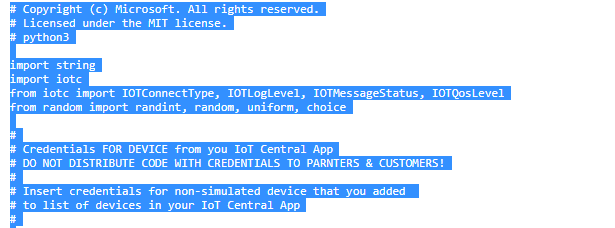
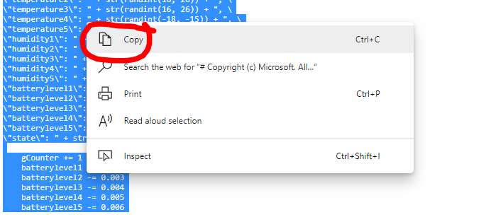
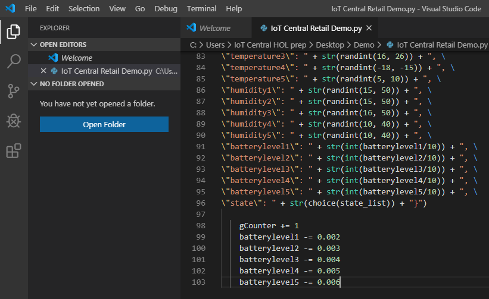
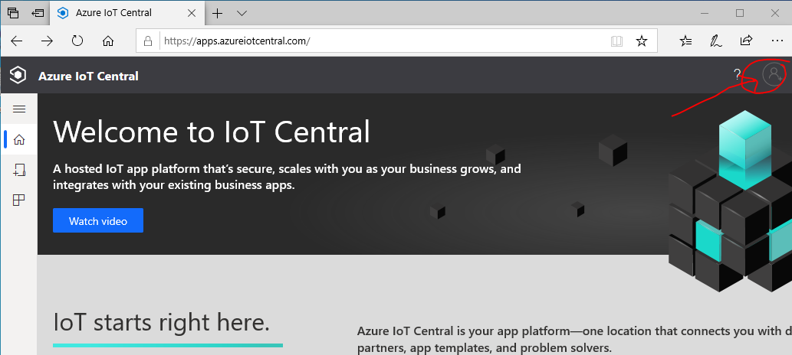
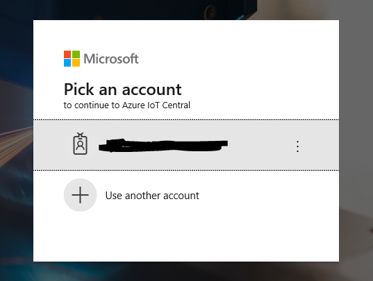

# LAB 1 - Retail Scenario

## Background story
You are at industry event and a visitor start discussion during networking session.
> Hello! 
My name is James Bond and I am owner of a retail store. It is important for me to be sure that environment in my store is good (not very cold and not too hot) and clients feels good. At the same time I need to be sure that dwell time is adequate and customers do not spend half of day in a queues. In addition, it is very important to be aware if temperatures in Frozen or Cold zones is out of normal range to avoid unnecessary lost from spoiled goods.
>
> What Microsoft can offer for me?

-	Our partner Contoso has new IoT solution that ideally fits with your needs.
-	Contoso device is certified as Plug and Play ready and you need just several minutes to start with it! You no need to be a programmer and cloud expert and it is very easy to calculate monthly cost of this solution, thanks to our Azure IoT Central SaaS offer.
-	Let me show you, how it works!

## What you need to do a live demo?
1. First of all, you need to prepare you laptop for demo using [this tutorial](link). If you done it before, please skip this clause.
2. You need to copy code of [Python Application](lab1/Multiple-Sensors-Devices_App.py) that will simulate device with multiple sensors
3. Create IoT Central application (Azure subscription is required) using Application Template (via shared link)
4. Add Real device into your application and assign that device to your Device Capability model
5. Copy Credentials for your device into Python application code and save this application.
6. Run Python application and see how telemetry go to IoT Central App.
7. Update Application Dashboard with new tiles that will show data that your data sends.

## 1. Prepare you laptop for demo
If you already prepared your laptop before, then skip step 1.
Please install required development environment on your laptop  (Python, IOTC client, VS Code) using this tutorial.

## 2. Copy Python Application code
Open page with [Python Application code](ADD LINK TO RAW FILE) in a new browser Tab using `Ctrl + left mouse click`.

 - Copy entire code from the file
 

 - Open VS Code and create New File

 - Paste code into new file. Code color is monochrome (white)
 
 
 

 - Save As file with Python Application extension `*.py`. 

- Code start to be colorful after files is saved.

## 3. Create Azure IoT Central application
 - Open [Azure IoT Central web-site](https://apps.azureiotcentral.com/)
 - Sign-in with your working Azure credentials (work account)
 
 
 
 
 **Note that using Azure IoT Central you can replicate Application in a seconds using** ***Application template export*** **feature. **
 
 - Click on [this link](https://apps.azureiotcentral.com/build/new/d500b389-0837-4518-85c8-e77d86b43451) to get Application Template for Custom Retail Demo.
