# 1. Prepare your laptop for demo

### Prepare your laptop
*Note* If you done it before, please skip this clause and go to [step 2](iotcentral-lab1-2.md)
* [install Python](#install-python-on-your-laptop)
* [check Python version](#check-python-version)
* [install IOTC client](#install-iotc-library-iot-central-python-client)
* [install Visual Studio Code](#install-vs-code)
* [install VS Code Extensions for Python](#install-vs-code-extensions-for-python)

### Install Python on your laptop:
* Download Python 3.8.0 (32-bit version) using this link https://www.python.org/ftp/python/3.8.0/python-3.8.0.exe
* Save File

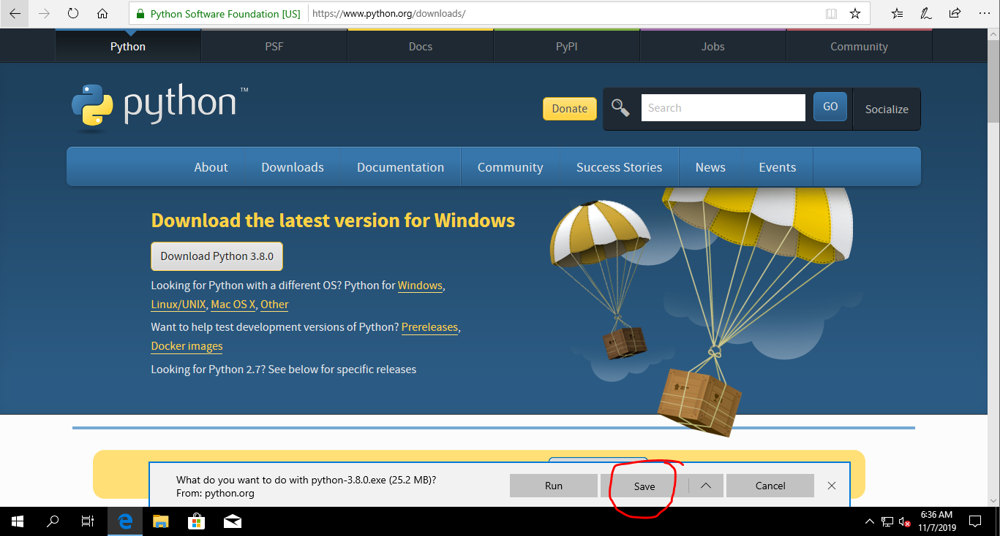

* Run downloaded file and check boxes like on image below:
  - [x] Install launcher for all users (recommended)
  - [x] Add Python 3.8 to PATH

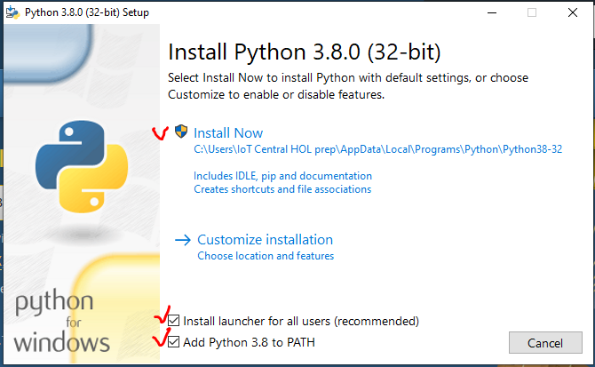

* Click on text **Disable path length limit** on Setup was successful message

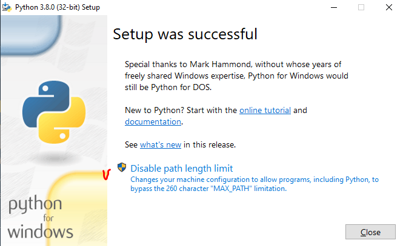

* Agree with User Account Control request - click Yes

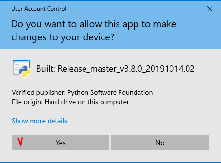

* Click Close button.

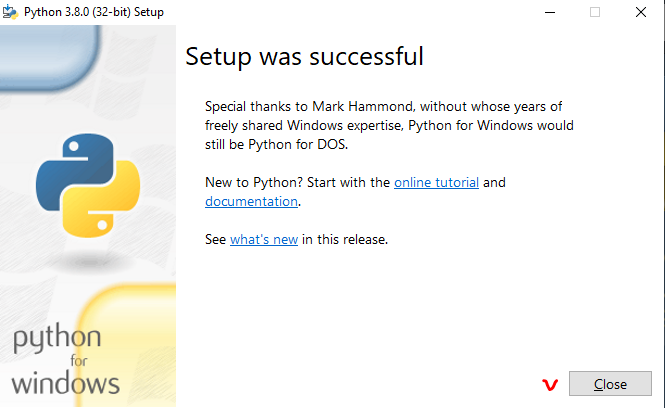

### Check Python version
Open **Command Prompt** (Win+R -> `cmd` -> Enter), type `python --version` text and push Enter.

You should see **Python 3.8.0** if everything done correct.

***Important*** If `python --version` does not work in Command Prompt, please Reboot you PC and try again.

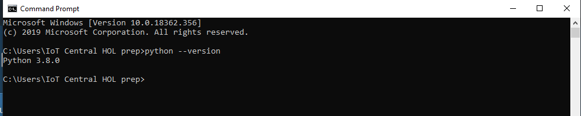

### Install IOTC library (iot central python client)
In Command Prompt type  `pip install iotc` and push Enter. You should see downloading progress bars and final message should look like this `Successfully installed httplib2-0.14.0, iotc-0.3.5 paho-mqtt-1.5.0`. Please note, that versions of libraries/packages may be different.

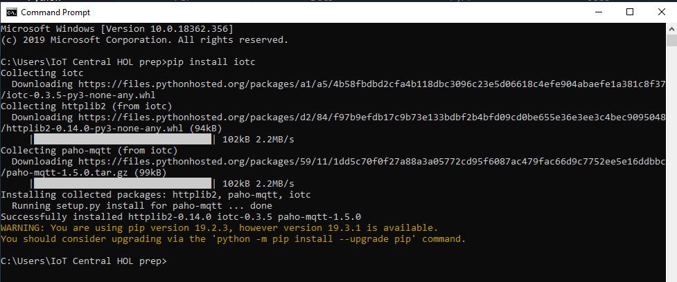

### Install VS Code 
(not mandatory, but it is much easier for eyes to work in VS code vs Python IDLE)
* Download VS Code using this link https://aka.ms/win32-x64-user-stable
* Save file on you PC and run it then.
* Agree with Terms and Conditions and click `Next` button

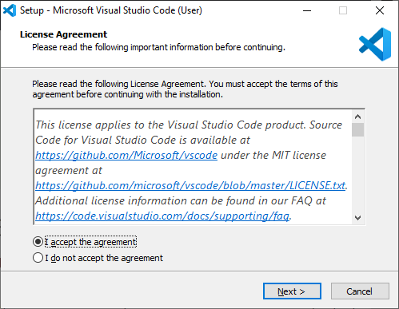

* Click `Next` button

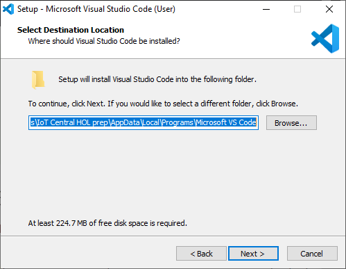

* Click `Next` button

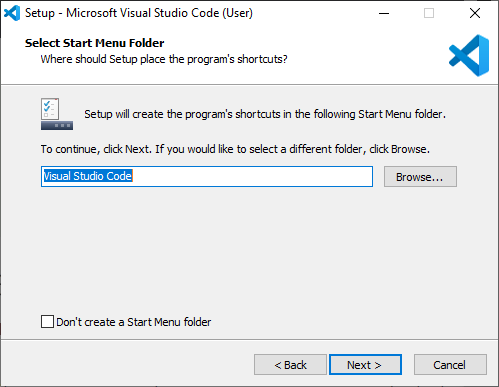

* [x] Check "Create a desktop icon"
* [x] Check "Open with Code" action to Windows Explorer file context menu"
* [x] Check "Open with Code" action to Windows Explorer directory context menu"
* [x] Check "Add to PATH (requires shell restart)"
- Then "Click `Next` button

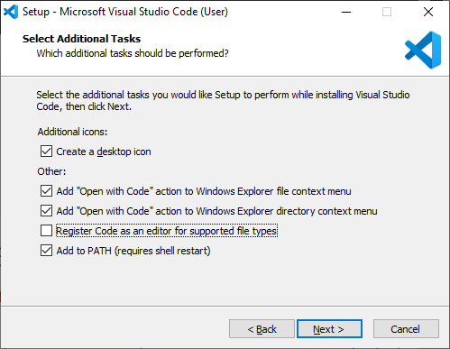

* Click `Install` button

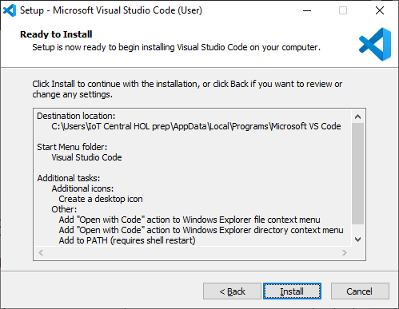

* [x] Check "Launch Visual Studio Code"
* Click `Finish` button

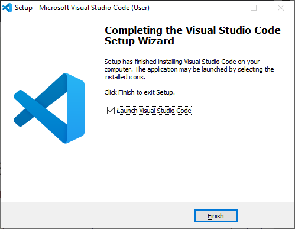

You should see VS Code start window like on image below.

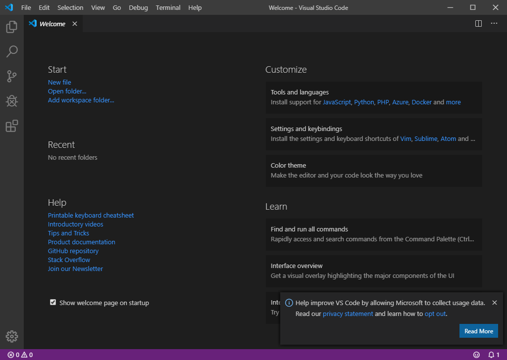

### Install VS Code Extensions for Python

Now you need to install two extensions that will help VS Code to understand and run Python Apps.
1. Install Python extension from Microsoft. To do this:
  - Go to Extension Menu and put in search window text `@id:ms-python.python`, then click `Install`
 
 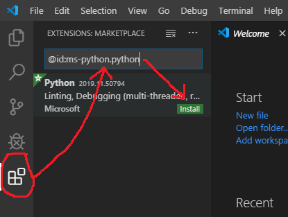
 
   - Then Click on `Terminal` and `New Terminal` on VS Code main window
 
   
   
   - Put text `& python -m pip install -U pylint --user` in Terminal window and push `Enter`
   
 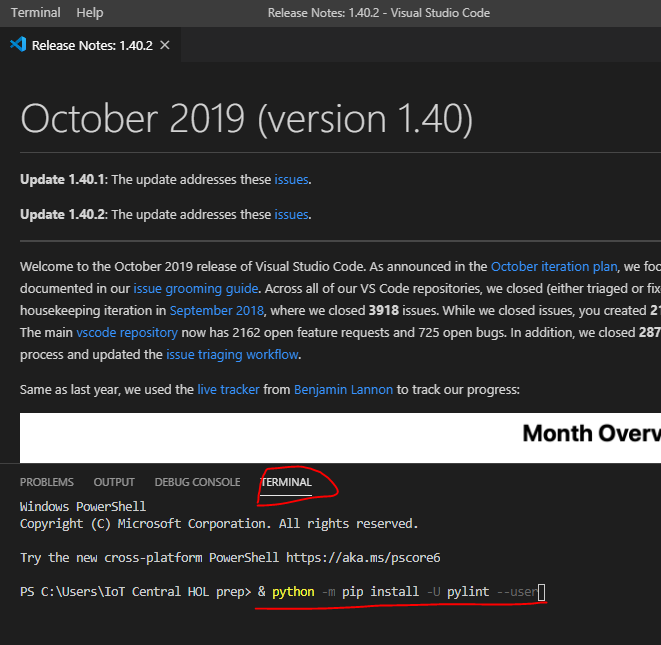

***Congratulation! Now your PC ready for HOL!***

### Lab Navigation Menu
[Go forward - 2. Copy Python Application code](iotcentral-lab1-2.md) 
[Go to main page of the LAB](iotcentral-lab1-0.md)
