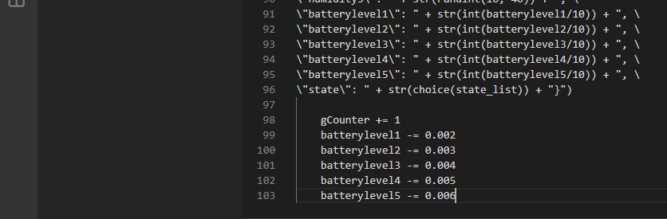

## 2. Copy Python Application code
Open page with [Python Application code](https://raw.githubusercontent.com/dmitriyteteruk/offsite-labs/master/lab1/Multiple-Sensors-Devices_App.py) in a new browser Tab using `Ctrl + left mouse click`.

 - Copy entire code from the file
 

 - Open VS Code and create New File

 - Paste code into new file. Code color is monochrome (white)
 
 
 

 - Save As file with Python Application extension `*.py`. 

- Code start to be colorful after files is saved.

### Lab Navigation Menu
[Go forward - 3. Create Azure IoT Central application](/iotcentral-lab1-3.md) 
[Go back - 2. Copy Python Application code](/iotcentral-lab1-2.md) 
[Go to main page of the LAB](/iotcentral-lab1-0.md)
