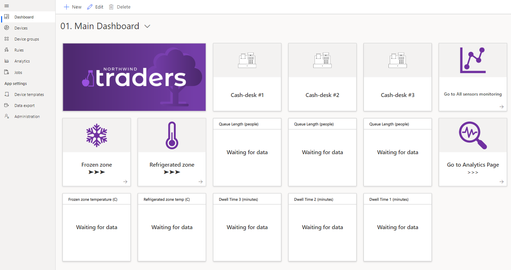

## 3. Create Azure IoT Central application
 - Open [Azure IoT Central web-site](https://apps.azureiotcentral.com/)
 - Sign-in with your working Azure credentials (work account)
 
 
 
 
 **Note that using Azure IoT Central you can replicate Application in a seconds using** ***Application template export*** **feature.**
 
 - Open in a new browser Tab using `Ctrl + left mouse click` [this link](https://apps.azureiotcentral.com/build/new/d500b389-0837-4518-85c8-e77d86b43451) to get Application Template for Custom Retail Demo.
 
You should see New application creation page. Please update below information:
 - **Application Name** - create something meaningful for your understanding
 - **URL** - you can leave it as it is
 - **Directory** should be chosen automatically as you are logged in
 - **Azure Subscription** - choose preferable subscription from the list
 - **Location** - choose Europe
 
 Click `Create` button and wait several seconds.

 

You should see your new application `Main Dashboard` once application is provisioned.

### Lab Navigation Menu
[Go forward - 4. Add Real device into your application](/iotcentral-lab1-4.md) 
[Go back - 2. Copy Python Application code](/iotcentral-lab1-2.md) 
[Go to main menu page](/iotcentral-lab1-0.md)

