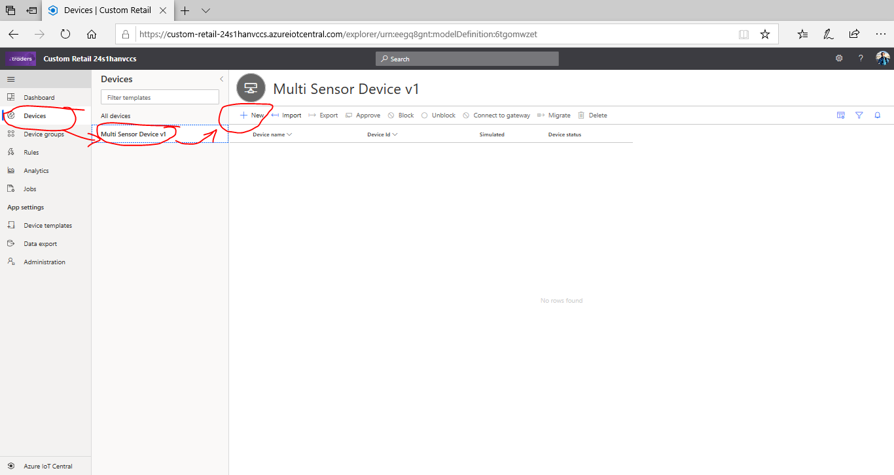
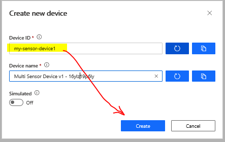
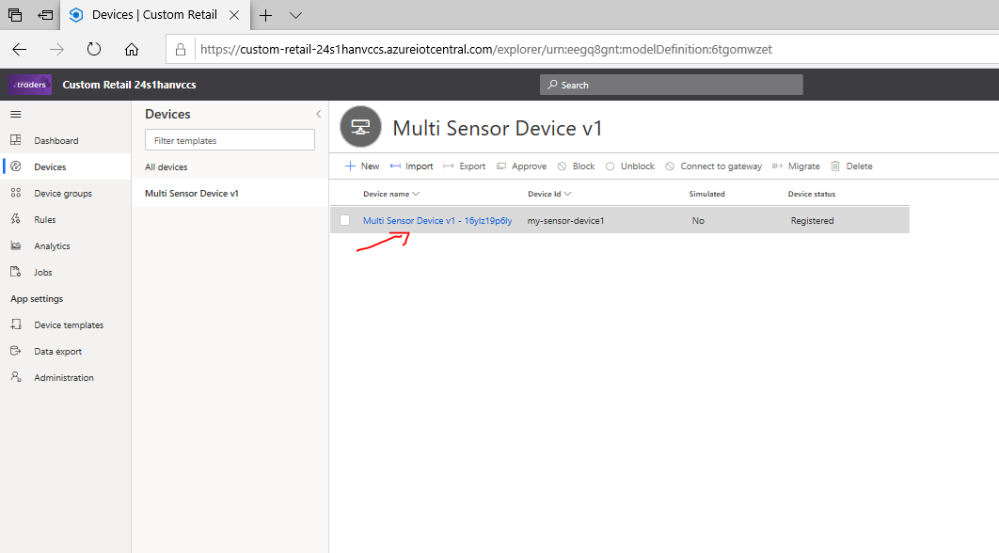
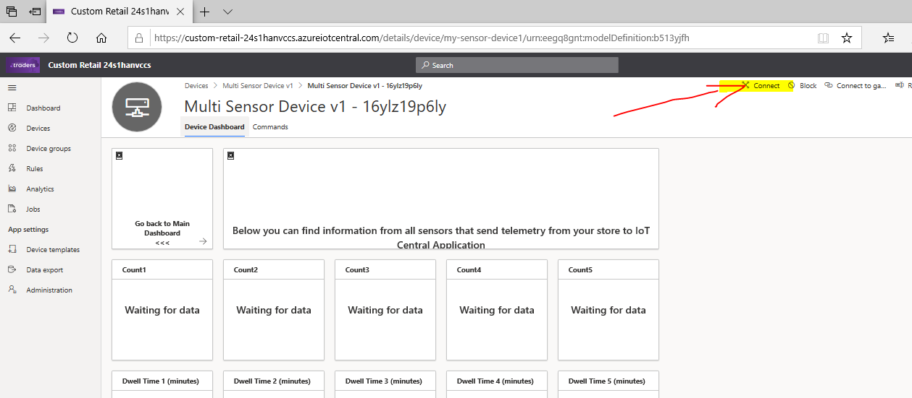
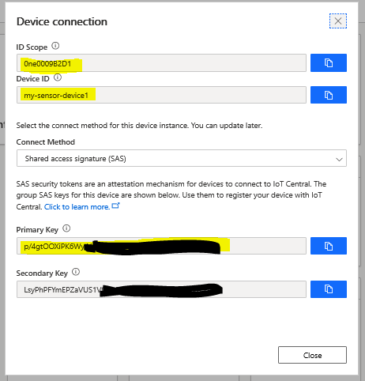

## 4. Add Real device into your application

Go to Navigation Menu of your IoT Central application at left side of page.
Click on  `Devices` -> `Multi Sensor Device v1` -> `+ New`

On **Create new device** dialogue enter **Device Id** `my-sensor-device1`, you can leave **Device Name** as it is. Then click `Create` button

Now you should see newly created device in the list. Click on Device Name.

You will see default Device View (Dashboard), but it does not contain any information.
Click on `Connect` icon on top right corner of the page.

**Device connection** window should appear on your screen.
You need to copy device credentials to you Python application code:
 - ID Scope
 - Device ID
 - Primary Key

You can copy credentials into Notepad application as in temporary storage.

### Lab Navigation Menu
[Go forward - 5. Copy Credentials for your device into Python application](/iotcentral-lab1-5.md) 
[Go back - 3. Create Azure IoT Central application](/iotcentral-lab1-3.md) 
[Go to main page of the LAB](/iotcentral-lab1-0.md)

