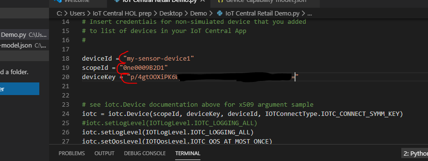
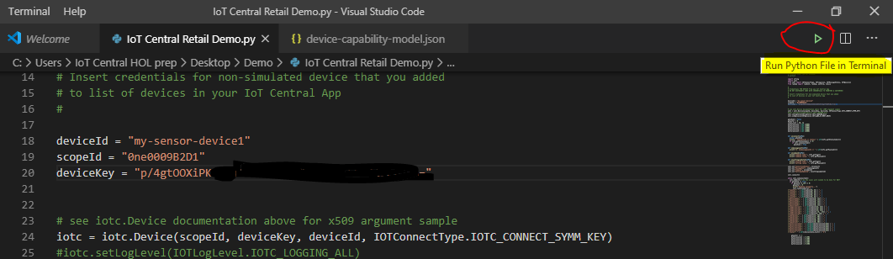
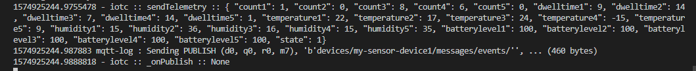
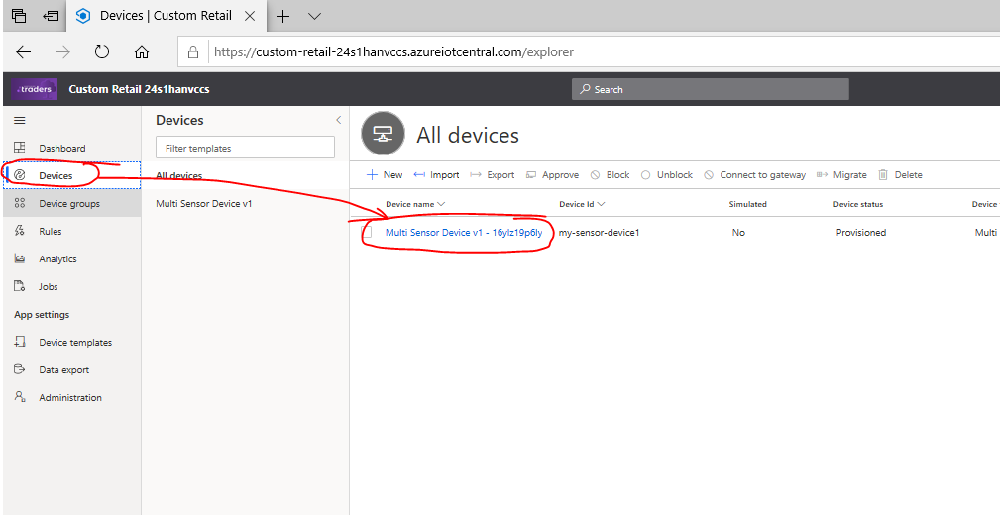
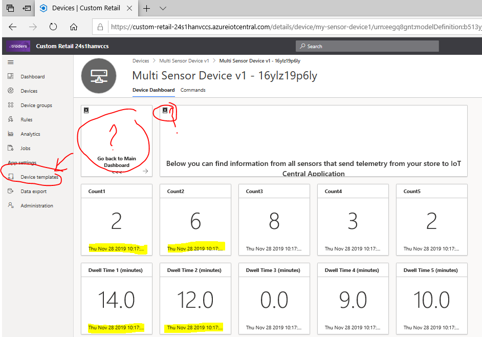

## 5. Copy device credentials into Python application and run it

Open file **Multiple-Sensors-Devices_App.py** in VS Code and paste Device credentials into it, then click `File -> Save` to save the file.

Then Click on `Run` icon on top right corner of VS Code window.

Your Python application should run now and you will see logs in Terminal window.
Once you see `sendTelemetry :: { .....` text - it means that telemetry start go to IoT Central application.

Now go to IoT Central application and check if telemetry is visible.
Click on `Devices` -> `Multi Sensor Device V1 - xxxx` name.

You should see default device Dashboard with numbers and timestamps in some tiles. 
*Please note.* Some tiles will look not good, because Application Template feature does not copying files (images) related in particular devices. We will fix broken tiles during next steps.

### Lab Navigation Menu
[Go forward - 6. Update Application Dashboard](/iotcentral-lab1-6.md) 
[Go back - 4. Add Real device into your application](/iotcentral-lab1-4.md) 
[Go to main page of the LAB](/iotcentral-lab1-0.md)
