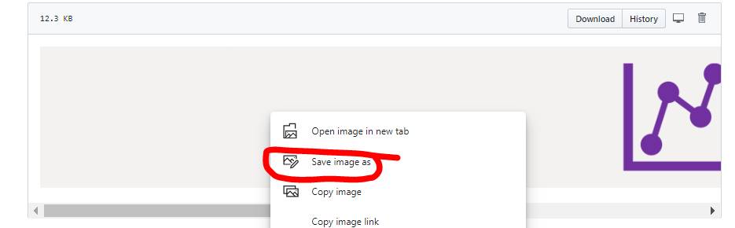

## 6. Update Default Device Dashboard

Open [this image](/icons/dashboard_icon.png) in a new browser window using `Ctrl + left click`. Then `Rigth click` on the image and choose `Save image as`, then save it on your PC. 

Open [this image](/icons/device-graphs-icon-1800x200.png) in a new browser window using `Ctrl + left click`. Then `Rigth click` on the image and choose `Save image as`, then save it on your PC. 

In IoT Central app menu click on `Device Templates` -> `Multi Sensor Device V1`

In device template menu click on `Device Dashboard`

Now you see default dashboard for your device template. 
Find tile with text **Go back to Main Dashboard <<<** and click on `gear-wheel` to modify it.

**Configure markdown content** menu appears on the screen. Click on Image icon to upload new image.

Find file with name `dashboard_icon.png` on your PC and upload it.

You should see new image icon once it is uploaded. Click `Update` button on bottom part of menu.

Find wide tile with text **Below you can find.....** and click on `gear-wheel` to modify it.

**Configure markdown content** menu appears on the screen. Click on Image icon to upload new image.

Find file with name `device-graphs-icon-1800x200.png` on your PC and upload it.

You should see new image icon once it is uploaded. Click `Update` button on bottom part of menu.

Now both updated tiles should look good. Click `Save` button on top-left part of the window to save you default dashboard view devices.

Then click `Publish` button on top-right part of the window to publish updated device template. Otherwise device will continue to use old template version.

Click `Publish` on menu that appears on the screen.

### Lab Navigation Menu
[Go forward - 7. Update Application Dashboards](/iotcentral-lab1-7.md) 
[Go back - 5. Copy device credentials into Python application and run it](/iotcentral-lab1-5.md) 
[Go to main page of the LAB](/iotcentral-lab1-0.md)
