## 7. Update Application Dashboards

Now we need to update three IoT Central application dashboards. Technically, you can create them from scratch, but some images already added on out visualization via Template Export.

We will update (re-create) tiles outlined with yellow color.

Click on `Dashboard` item on IoT Central application menu. Check that you are on **01. Main Dashboard** page and then click `Edit` button on the top left corner of the window.

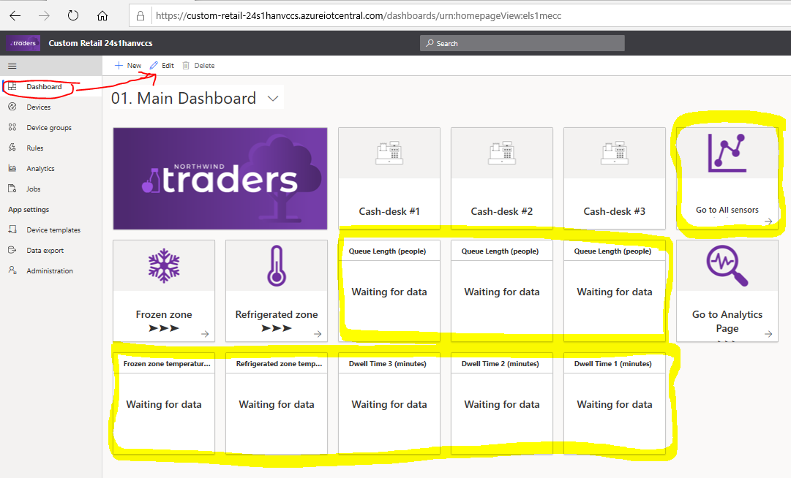

Once edit option appears use `X` icon to remove tiles from dashboard.

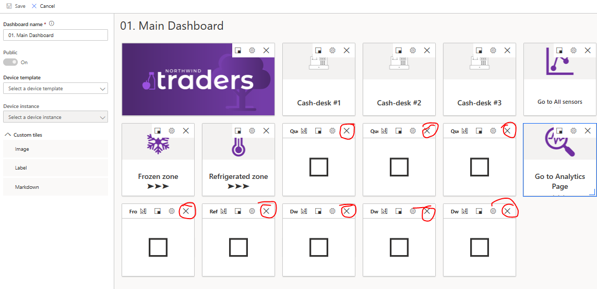

You dashboard should look like this now.

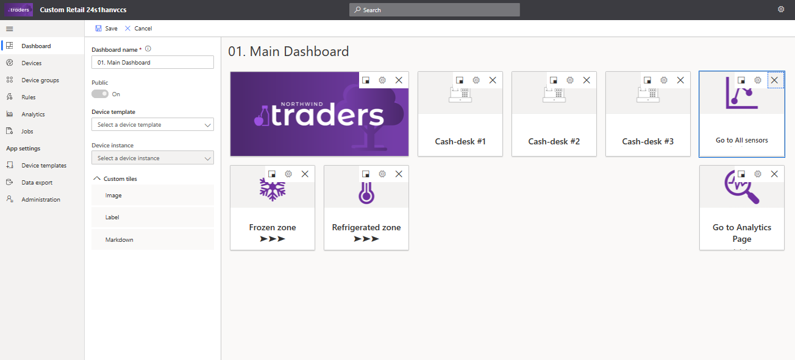

Now you need add new tiles.  
In Dashboard menu choose `Multi Sensor Device v1` in *Device template* drop-down menu, then choose `Multi Sensor Device v1 - xxxxx` in *Device instance* drop-down menu. You will see list of all possible telemetry options that we are collecting.

Drag and Drop to dashboard following telemetry tiles:
 - Count1 (this is people counter sensor installed near cahs-desk #1)
 - Count2 (this is people counter sensor installed near cahs-desk #2)
 - Count3 (this is people counter sensor installed near cahs-desk #3)
 - Dwell Time 1 (this is time counter sensor installed near cahs-desk #1)
 - Dwell Time 2 (this is time counter sensor installed near cahs-desk #2)
 - Dwell Time 3 (this is time counter sensor installed near cahs-desk #3)
 - Temperature4 (this is temperature sensor installed in Frozen area -20-15 degrees)
 - Temperature5 (this is temperature sensor installed in Refrigerated area +5+10 degrees)
 
You can drag and drop and modify tiles one by one or drag and drop all tiles and then modify them.

 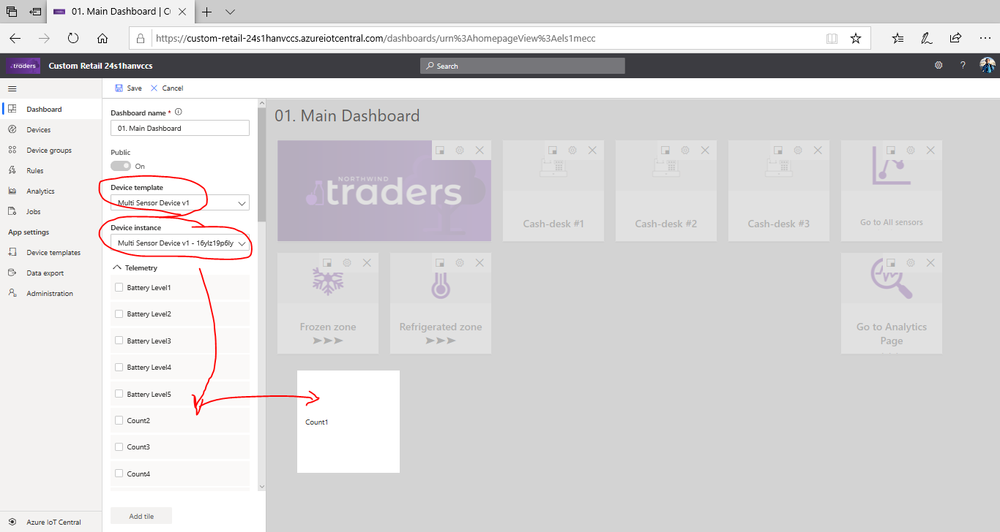
 
 Now click on `Save` button to see if our tiles show real-time data from our simulated device.
 
 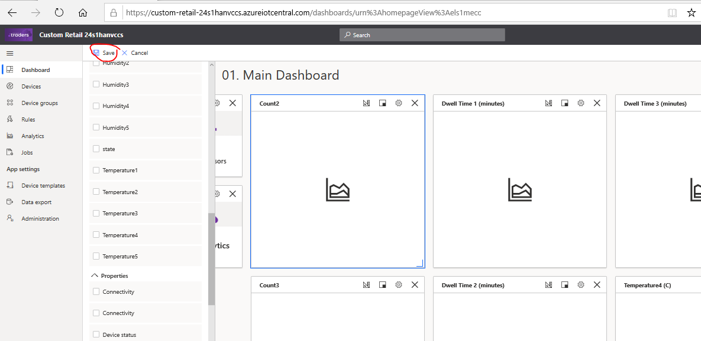
 
 If you see graphics on you tiles then everything is correct and we need to do some design modifications for these tiles. 
 Click `Edit` button on top of Dashboard name.
 
 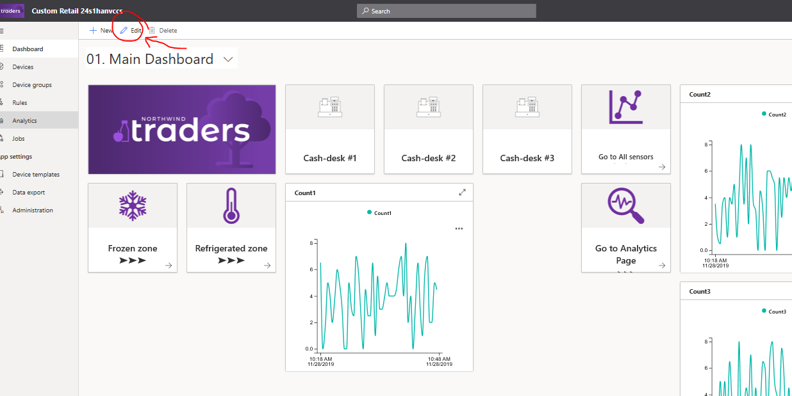
 
 ### Modify Count tiles
 
 Find tile **Count1** and hover on `rulers` icon and click on it, then choose `Last Known Value` option in drop-down list.
 
 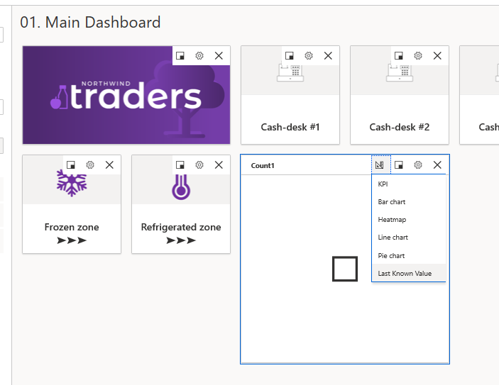
 
**Configure last known value** menu will appear on the left side. Change name from **Count1** to **Queue Length (people)** and then click `Update` button.
 
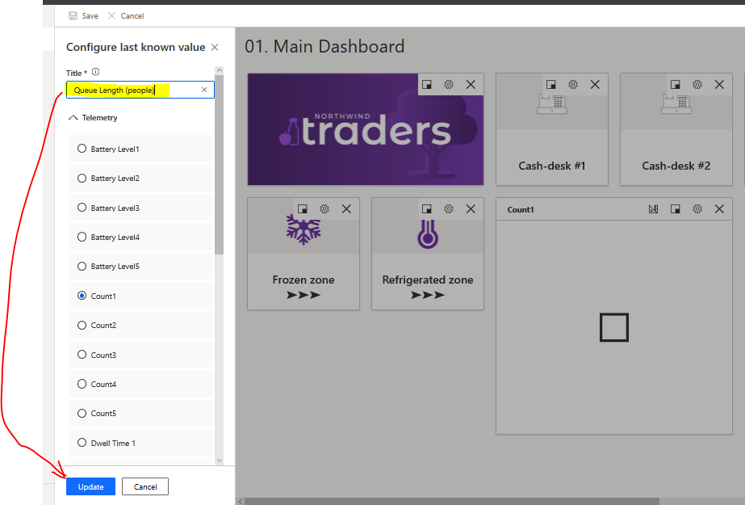
 
Repeat this for tiles Count2 and Count3, then Click `Save` on the top left corner of Dashboard Menu.

Click `Edit` then and resize tiles with name **Queue Length (people)** to 1x1 option. It is not available in size-menu (left side from gearwheel), but you can change size using mouse.

Click on the bottom right corner of the tile and pull it to the top left corner. Repeat this action for all tiles named **Queue Length (people)** then Click `Save` on the top left corner of Dashboard Menu.
*Note* that option to resize `Last Know Value` tiles available only after you `Update` tile and `Save` dashboard.

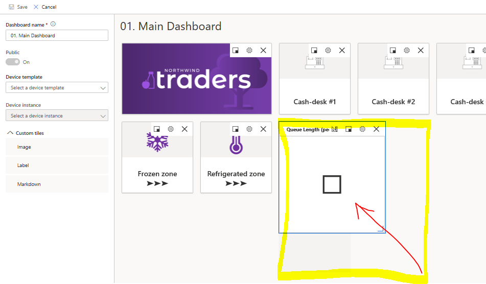
 
 Updated **Queue Length (people)** tile should look like on image below.
 
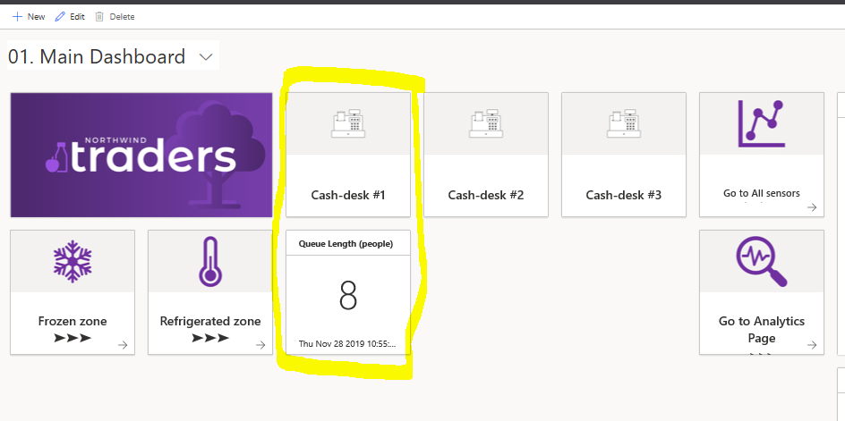

### Modify temperature tiles

You should be in `Edit` mode of your dashboard.  
Find tile **Temperature4** and hover on `rulers` icon and click on it, then choose `Last Known Value` option in drop-down list. 
Change `Title` to **Frozen Zone Temp (C)**. Click `Update` button.  

Find tile **Temperature5** and hover on `rulers` icon and click on it, then choose `Last Known Value` option in drop-down list. 
Change `Title` to **Refrigerated Zone Temp (C)**. Click `Update` button, then `Save` button.  
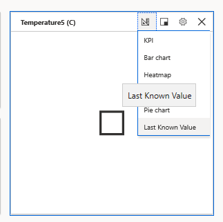 
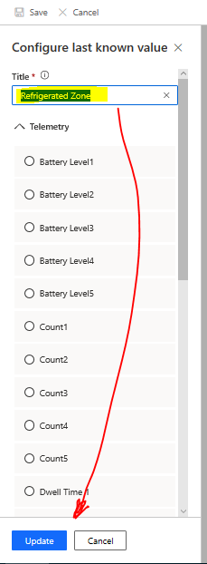

Click `Edit` then and resize tiles with name **Frozen Zone Temp (C)** and **Refrigerated Zone Temp (C)** tiles to 1x1 size.  
Click on the bottom right corner of the tile and pull it to the top left corner.

Move tiles under appropriate tile on Dashboard. Click `Save` on the top left corner of Dashboard Menu.

### Modify Dwell Time tiles

 Find tile **Dwell Time 1** and hover on `rulers` icon and click on it, then choose `Last Known Value` option in drop-down list.
 
 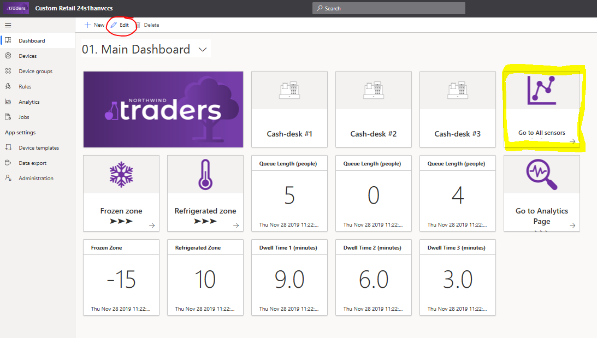
 
**Configure last known value** menu will appear on the left side. Change name from **Dwell Time 1** to **Dwell Time 1 (minutes)** and then click `Update` button.
 
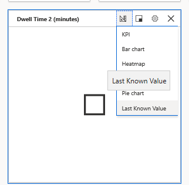
 
Repeat this for tiles **Dwell Time 2** and **Dwell Time 3**, then Click  `Save` on the top left corner of Dashboard Menu.

Click `Edit` then and resize tiles with name **Dwell Time x (minutes)** names to 1x1 size.  
Click on the bottom right corner of the tile and pull it to the top left corner.

Move **Dwell Time** tiles under **Queue Length (people)** tiles. 

Then Click `Save` on the top left corner of Dashboard Menu.

Now you Dashboard should start show real-time numbers and looks like on below image.

## Update link to device page
Click on `Devices` link in IoT Central application menu and then click on device name `Multi Sensor Device v1 xxx`.

Copy link from address bar in your browser window `/details/device/my-sensor-device1/`

Click on `Dashboard` link in IoT Central application menu

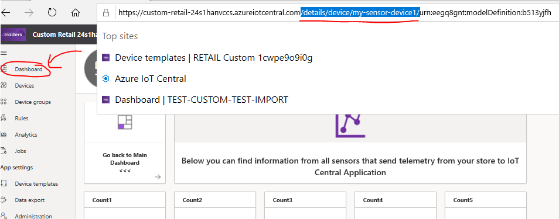

Click `Edit` button on Dashboard page

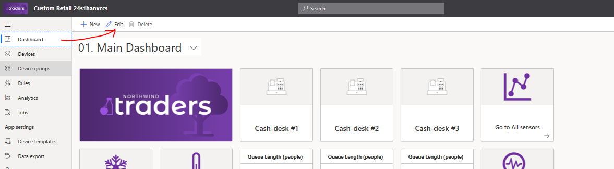

Click `Gearwheel` icon on tile with text **Go to All sensors**

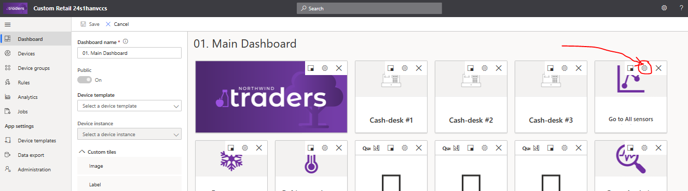

Paste copied URL into **URL** area, then click on `Update` button and then `Save` button.

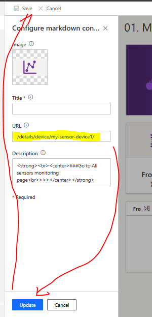

## Update Frozen Zone dashboard
Click on arrow to the right of **01 Main Dashboard** name to see list of available dashboards via drop-down menu. 
Choose **Frozen Zone Dashboard**

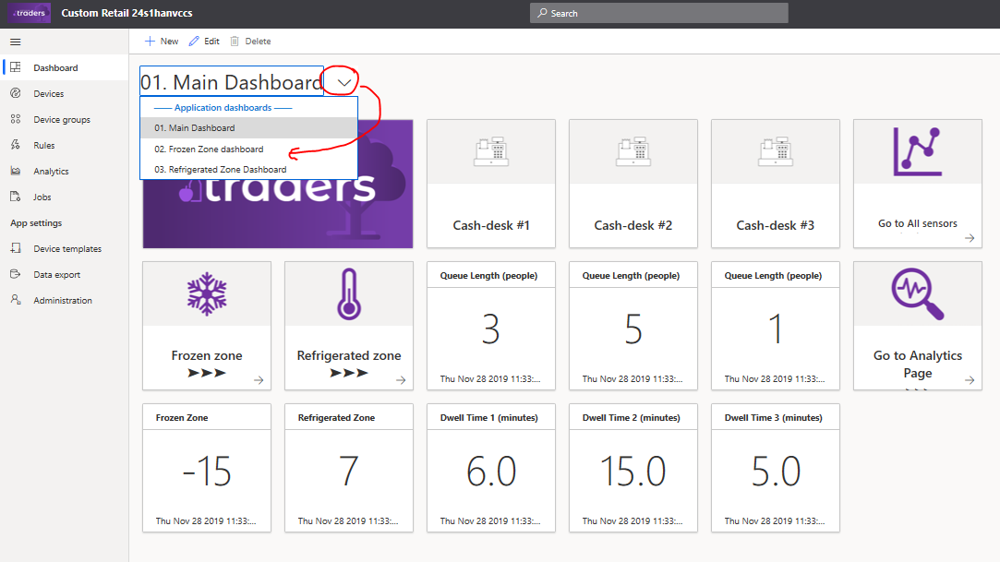

On page of **Frozen Zone Dashboard** click on `Edit` button. You need to modify (re-create) 4 tiles outlined with yellow color.

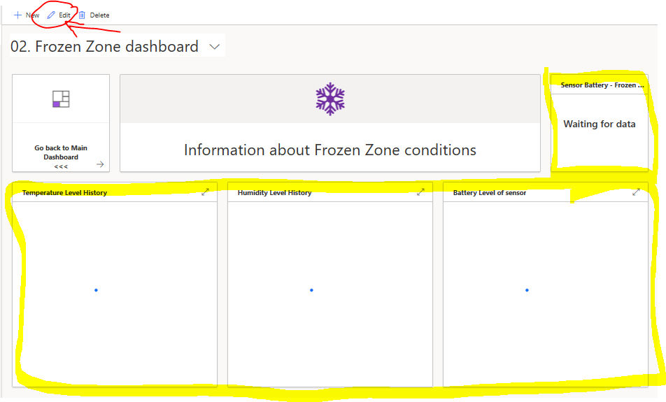

Once edit option appears use `X` icon to remove four tiles from dashboard.

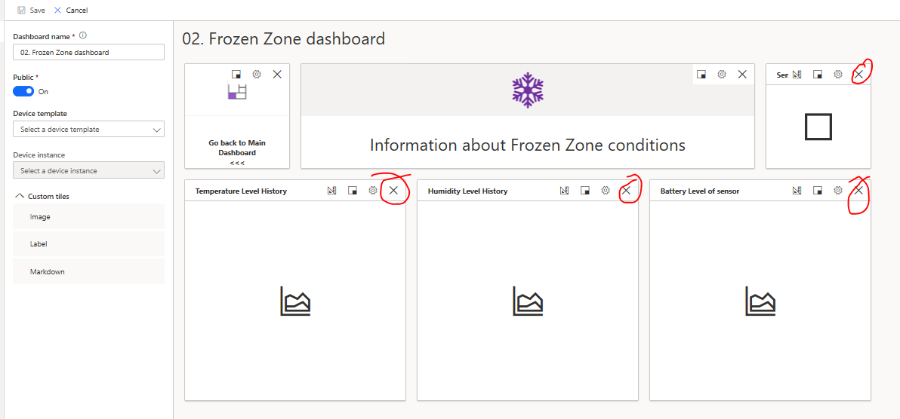

Now you need add new tiles.  
In Dashboard menu choose `Multi Sensor Device v1` in *Device template* drop-down menu, then choose `Multi Sensor Device v1 - xxxxx` in *Device instance* drop-down menu. You will see list of all possible telemetry options that we are collecting.

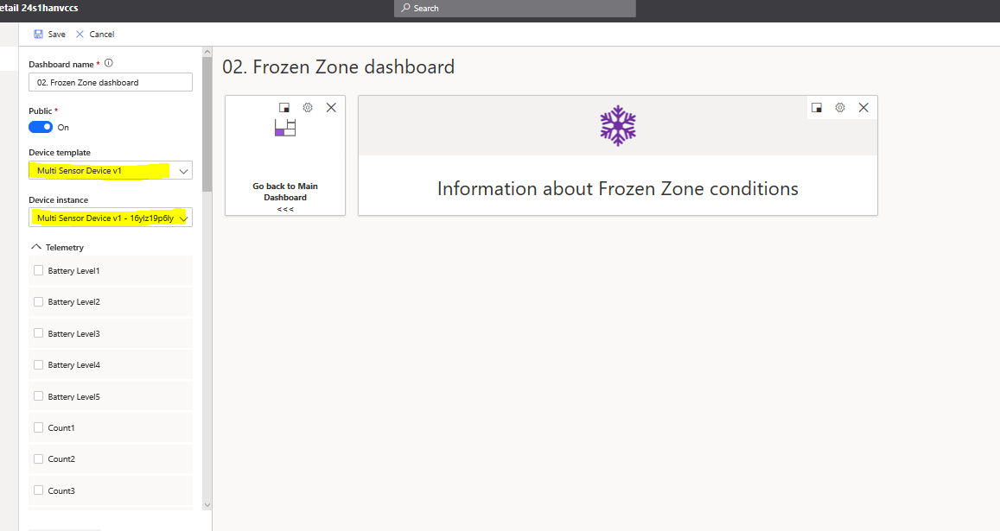

Drag and Drop to dashboard following telemetry tiles: 
 - **Temperature4** (this is temperature sensor installed in Frozen area -20-15 degrees) - add to times
 - **Humidity4** (this is humidity sensor installed in Frozen area)
 - **Battery4** (this is battery level from sensor installed in Frozen area)
 
 This is how your **Frozen Zone dashboard** should look like now.
 
 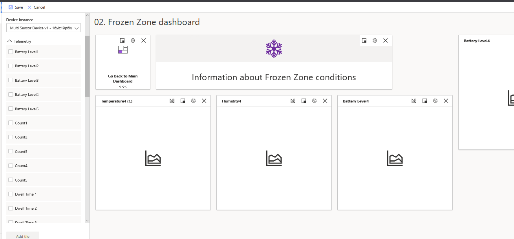
 
Now we need to update tiles names to meaningful information:

Find tile **Temperature4** and hover on `rulers` icon and click on it, then choose `Linear chart` option in drop-down list.

 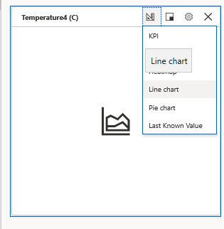

Change title name to **Temperature History (12h)**, choose **Past 12 hours** option from `Time range` drop-down list. Click `Update`. 

Repeat same actions for **Humidity4** and **BatterLevel4** tiles. 
As result you should have 3 `Linear charts` with history for 12 hours of Temperature, Humidity and Battery level.

Find tile **BatteryLevel4** and hover on `rulers` icon and click on it, then choose `Last Known Value` option in drop-down list.

 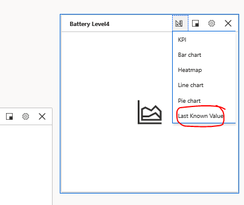

Change title name to **Temperature History (12h)**, choose **Past 12 hours** option from `Time range` drop-down list. Click `Update` and then click `Save`.  
Click `Edit` and resize tile to 1x1 size using you mouse. Move tile to the top right corner of the dashboard. 

 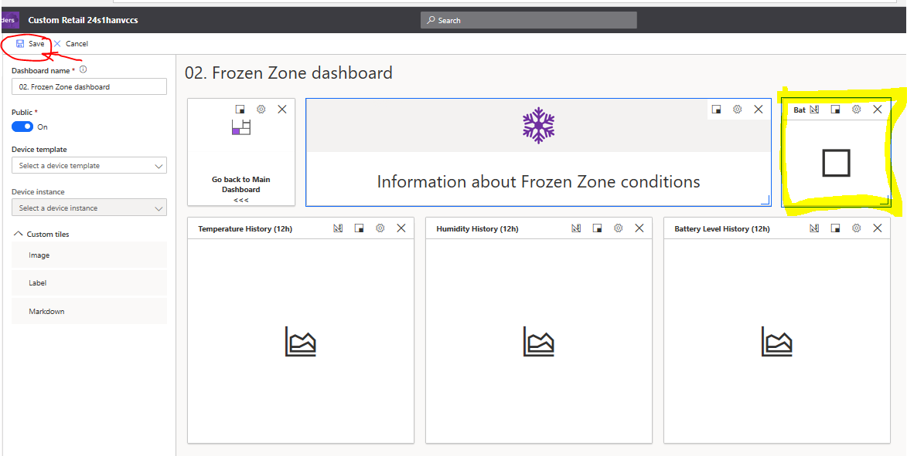
 
 Click on `Save` button.
 
 Once dashboard is updated you should see history data in it like on image below.
 
 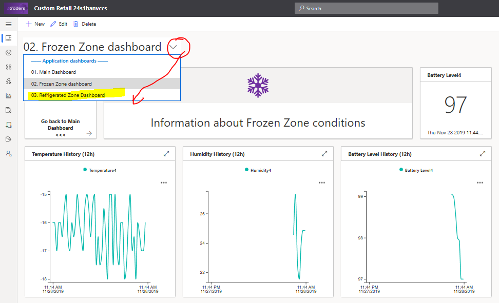
 
## Update Refrigerated Zone dashboard
Repeat steps from **Update Frozen Zone dashboard** exercise, but choose **Temperature5**, **Humidity5**, **BatteryLevel5** telemetry. 
As result you should see **Refrigerated Zone dashboard** like on image below.
 
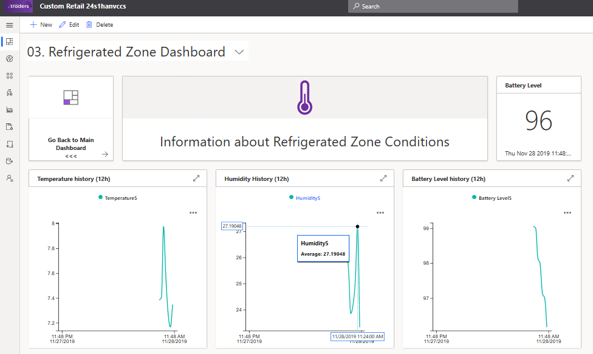

### Lab Navigation Menu
[Go forward - 8. Add image to your IoT Central application](/iotcentral-lab1-8.md) 
[Go back - 6. Update Default Device Dashboard](/iotcentral-lab1-6.md) 
[Go to main page of the LAB](/iotcentral-lab1-0.md)
