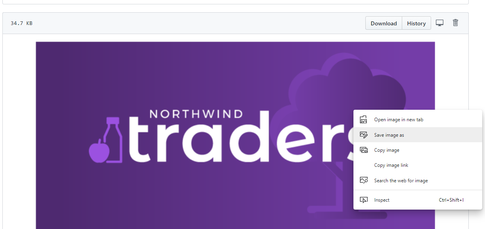
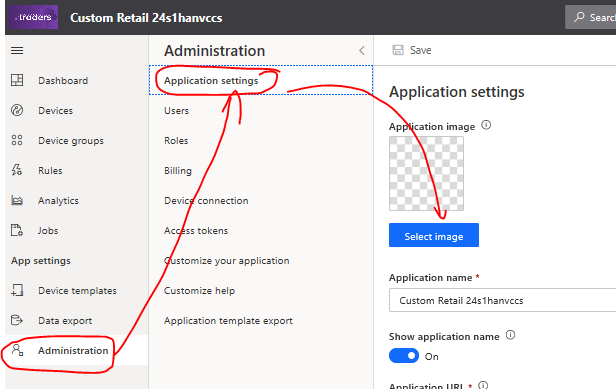
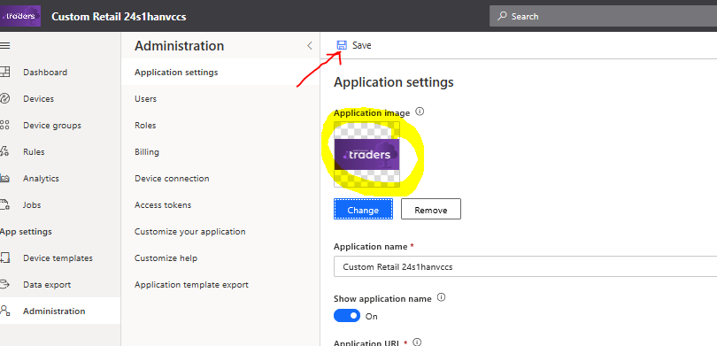
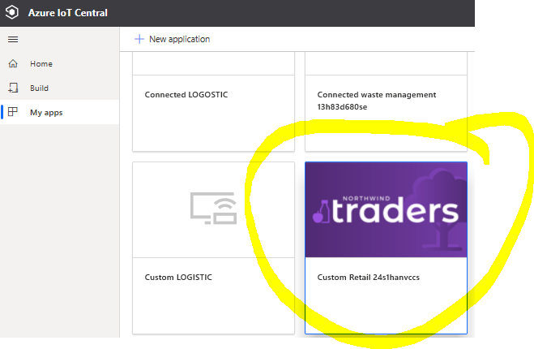
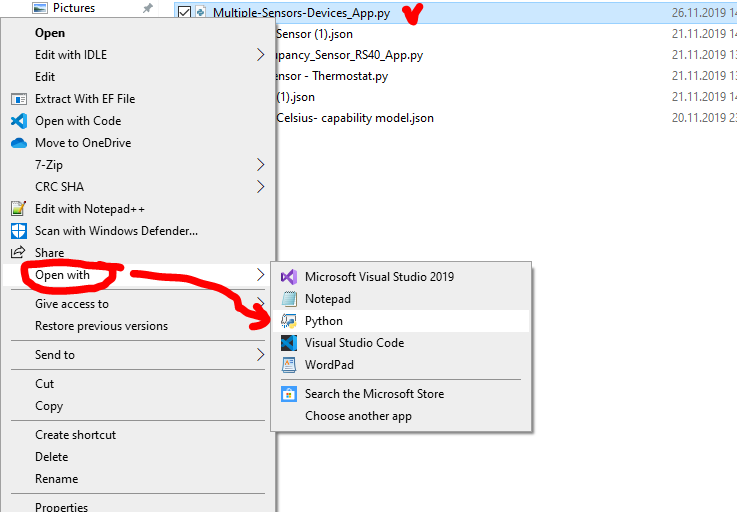
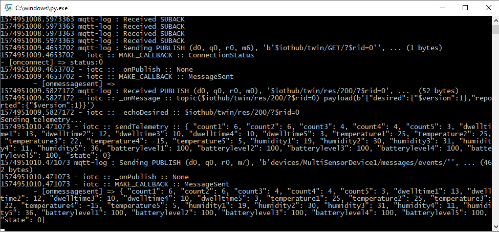

## 8. Add image to your IoT Central application

Open [this image](/icons/dashboard_icon.png) in a new browser window using `Ctrl + left click`. Then `Rigth click` on the image and choose `Save image as`, then save it on your PC. 

Click on `Administration` button in IoT Central application menu. 
Then click on `Application settings` button and then `Select image` button. 

Find `store-logo.png` file on your PC and doble click on it. Once logo is added click `Save` button.

Go back to [My apps IoT Central page](https://apps.azureiotcentral.com/myapps) and check that logo is visible.

## Closing words
Congratulations! 
Now you can demonstrate to any partner or customer how IoT Central SaaS works and it is value.
You can change Dashboard and Tiles with a few clicks, add/remove/change (Rules) and demo Time Series Insights value using Analytics page.

Do not forget to run Python application to see real-time data in you application during demo.
The easiest way to Run the app is:
 - Open folder with your Python app in Explorer app (file explorer)
 - `Right click` on Python file -> choose option `Open with` -> choose option `Phyton`

And you will see Command Prompt with your application!

### Lab Navigation Menu
[Go forward - 9. Bonus: Adding Plug and Play device demo](/iotcentral-lab1-9.md) 
[Go back - 7. Update Application Dashboards](/iotcentral-lab1-7.md) 
[Go to main page of the page LAB](/iotcentral-lab1-0.md) 
