## 9. Bonus: Adding Plug and Play device demo

Mr. Bond was very impressed with your demonstration of Azure IoT Central. But he asked on more question to you:
>It was great demo and I feel that it is exactly what I need, but what if I would like to add more sensors different from what you demonstrate to me? How difficult is it?

### Now, you will do real demo of adding Plug and Play Device to current IoT Central Application

> Great questions, Mr. Bond! Microsoft is simplifying IoT with Azure IoT Central SaaS offering and more and more device builders certify their devices for Plug and Play technology that helps end-customers to use IoT without any problems! Let me show!

### Open IoT Central Application that you demonstrate to Mr. Bond.

* Open `Device templates` tab in application menu on the left side and then click on `+New` button. 

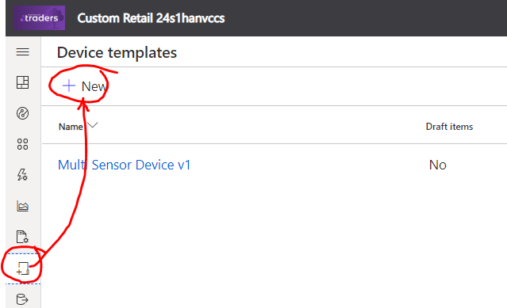

* Then scroll down page until you can find *S1 Sensor* device in the list of IoT Plug and Play pre-certified devices. Click on *S1 Sensor* device and then on `Next: Customize` button.

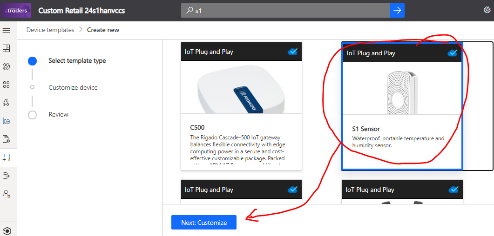

* Then click on `Create` button

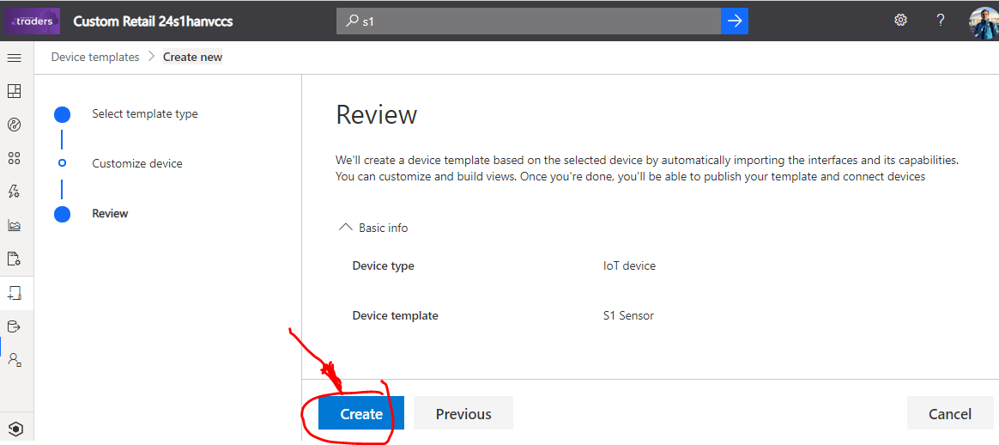

On next page you can see all information in added device template for S1 Sensor devices. You can see that *S1 Sensor* devices just following telemetry: battery level, temperature & humidity. Very simple comparing with our *Multi Sensor Device v1*.

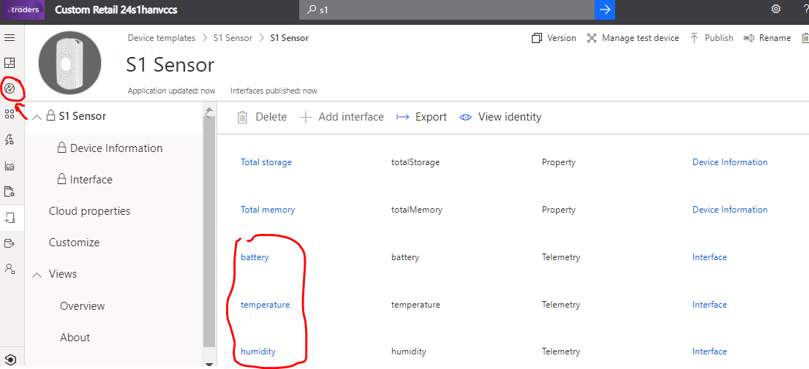

* Now we need to go to `Devices`, click on `S1 Sensor` template and then click on `+ New` button.

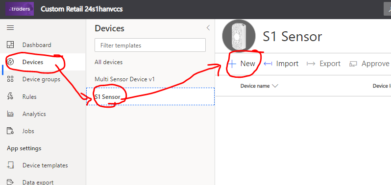

* On pop-up window with new device information rename device to something meaningful for you, `s1-sensor-1` for example.
* Then click on `Create` button.

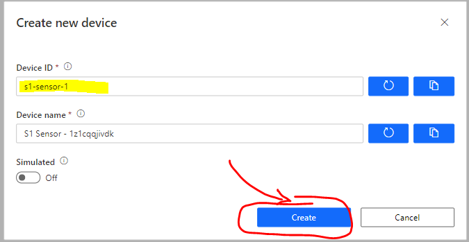

Now [open link with source code](https://raw.githubusercontent.com/dmitriyteteruk/offsite-labs/master/lab1/Single-S1-sensor%20-%20Thermostat.py) of *S1 Sensor* simulator Python app in a new browser Tab using `Ctrl + left mouse click`.
- Copy entire code from the file (`Ctrl+A` to select all and `Ctrl+C` to copy or use mouse).

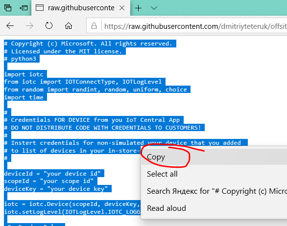

 - Open VS Code and create New File

 - Paste code into new file. Code color is monochrome (white)
 
  
 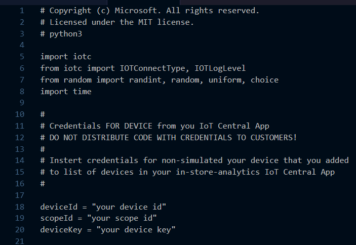 
 
 - Save As file with Python Application extension `*.py`. 
 

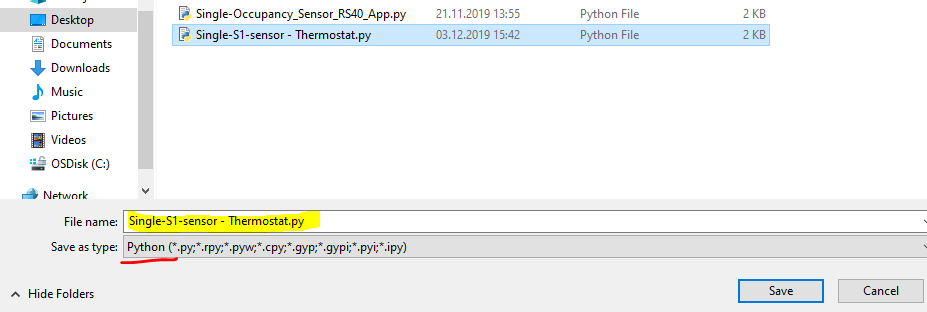
 
 - Code start to be colorful after files is saved.
 
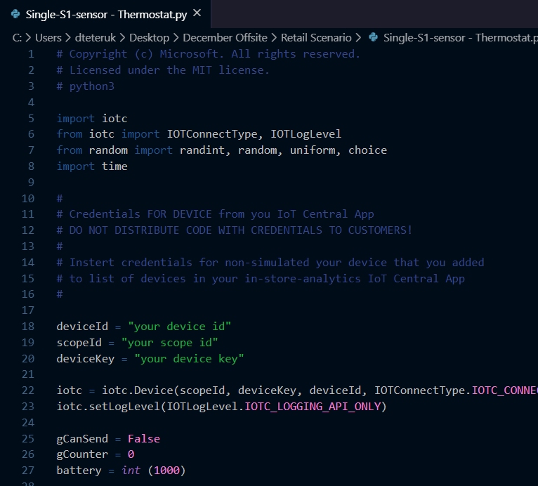
  
Then go back to IOT Central application page where your newly added *S1 Sensor* was added and click on device name.
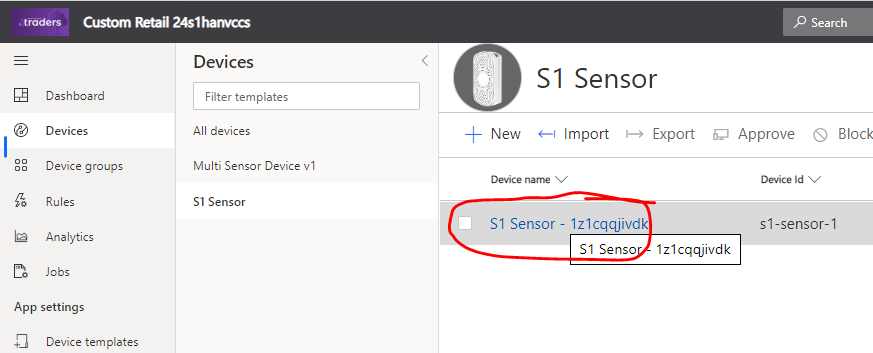
   
Here you will see default device dashboard that was created by device manufacturer. Let's generate some data with our Python app to see real number.

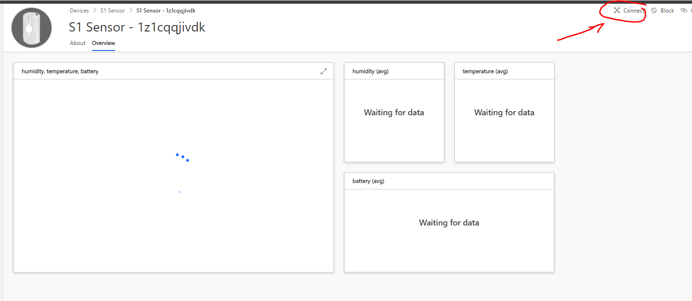

* Click on `Connect` button and copy `DeviceId`, `ScopeId` and `Primary Key` to Notepad.

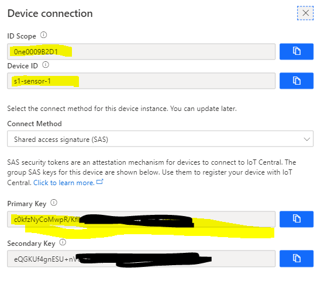

Now Paste `DeviceId`, `ScopeId` and `Primary Key` into Python app for this sensor. Save it and Run!

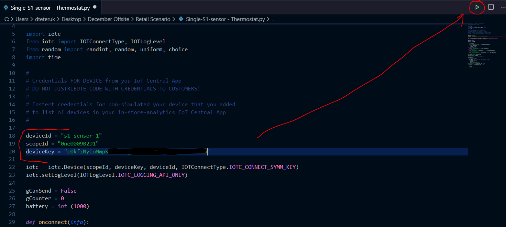

You should start see logs with telemetry message from app to IoT Central and data should be visible on Device Dashboard page.

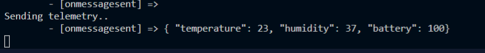
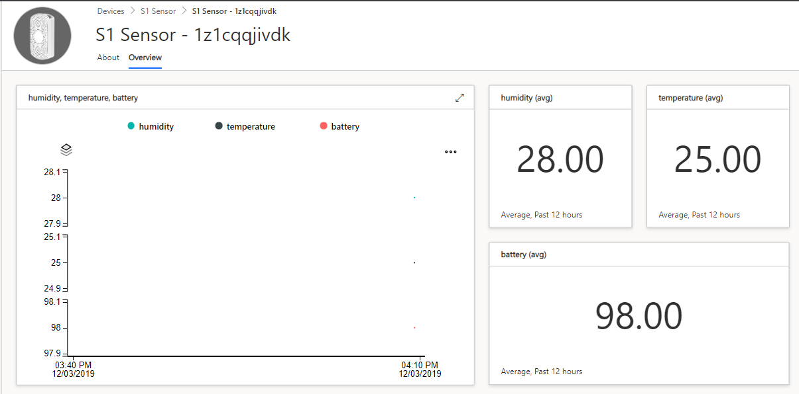

> So Mr. Bond, you can see that if you want to start use IoT technology fast it is very easy to do with Azure IoT Central and IoT Plug and Play technology!

# The End.

### Lab Navigation Menu
[Go back - 8. Add image to your IoT Central application](/iotcentral-lab1-8.md) 
[Go to main page of the page LAB](/iotcentral-lab1-0.md)
